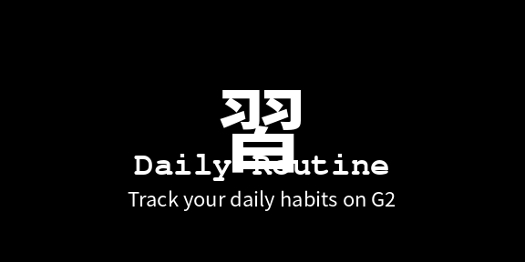

# Daily Routine

EVEN Realities G2 用のハンズフリー習慣トラッカー。日々のルーティンタスクを G2 の HUD に表示し、テンプルのタップだけでチェックを切り替えられます。タスクの編集はスマホ側 WebView で行います。



## 特徴

- **G2 ハンズフリー操作** — スワイプでカーソル移動、タップでチェック切替
- **スマホ側編集UI** — 追加・編集・削除・順序入替・全リセット
- **日次自動リセット** — 日付が変わると `done` 状態がクリア
- **完全オフライン** — ネットワーク・AI・サードパーティサービス不使用
- **権限ゼロ** — マイク・位置情報・ネットワーク等すべて不要
- **永続化** — `bridge.setLocalStorage` で companion app のストレージに保存
- **ライフサイクル対応** — 公式ガイドライン準拠の終了ダイアログ

## アーキテクチャ

```
┌─────────────────────────┐       ┌─────────────────────────┐
│ スマホ WebView          │ Storage│ G2 HUD                 │
│ (Even Realities 内)    │ ←───→  │ (576×288 4-bit greyscale)│
│                         │ (bridge│                         │
│ ・タスク編集フォーム    │  Local │ ・チェックリスト表示    │
│ ・追加/編集/削除/並替  │ Storage│ ・スワイプ操作          │
│ ・全リセット            │   )    │ ・タップでトグル        │
└─────────────────────────┘       └─────────────────────────┘
              ↑                                ↑
              └──── 同一 WebView 内の JS ───┘
                  (src/main.ts が両方を制御)
```

- **WebView (Flutter)** が `src/main.ts` を実行
- 同じ JS が **DOM 操作(スマホ側UI)** と **bridge イベント(G2側)** の両方を担当
- データは `bridge.setLocalStorage` でストレージに永続化、両側から共有

## プロジェクト構成

```
EVEN_G2_routine/
├── README.md                       ← このファイル
├── app.json                        ← Even Hub マニフェスト
├── package.json
├── tsconfig.json
├── vite.config.ts
├── index.html                      ← スマホ側UI (フォーム markup)
├── src/
│   └── main.ts                     ← G2 + スマホ両方のロジック
├── routine.ehpk                    ← パッケージ済み配布物
├── dr-icon-24.png                  ← App icon (24×24 mono)
├── dr-cover.png                    ← Store cover (576×288)
├── dr-screenshot-1-start.png       ← Store screenshots
├── dr-screenshot-2-progress.png
└── dr-screenshot-3-done.png
```

## 操作

### G2 (HUD)

| ジェスチャー | 動作 |
|---|---|
| スワイプ ↑ | カーソル ▶ を上へ |
| スワイプ ↓ | カーソル ▶ を下へ |
| シングルタップ | カーソル位置のタスクを ☑/☐ トグル |
| ダブルタップ | 終了ダイアログ |

### スマホ (Even Realities アプリ内 WebView)

| 操作 | 結果 |
|---|---|
| `+ タスクを追加` | リスト末尾に「新しいタスク」を追加 |
| 入力欄の値変更 | フォーカス外しで自動保存 |
| `▲` ボタン | タスクを 1 つ上へ移動(チェック状態も連動) |
| `▼` ボタン | タスクを 1 つ下へ移動 |
| `✕` ボタン | 削除(確認ダイアログあり) |
| `今日のチェックをすべてリセット` | done フラグだけ全てクリア |

## データモデル

`bridge.setLocalStorage` で 2 つのキーに保存:

```ts
// "routine_tasks_v1"
type Tasks = string[]   // 例: ["朝のストレッチ", "水を1L飲む", ...]

// "routine_state_v1"
interface State {
  date: string          // YYYY-MM-DD
  done: boolean[]       // tasks と同じ長さ
}
```

- 起動時、`state.date` が今日と異なれば自動でリセット
- タスクの追加・削除・並べ替え時、`done` の対応する要素も同期して更新

## 開発

### 前提

- Node.js v20 LTS 以上
- 同じ tailnet 上の Spark(または別のホスト)— ただし Daily Routine は**ネット不要**なのでビルドだけ Spark でできれば充分

### セットアップ

```bash
cd /home/y_orihara/EVEN_G2_routine
npm install
```

### ビルド & パッケージ

```bash
npm run build                                    # dist/ を生成
npx evenhub pack app.json dist -o routine.ehpk   # .ehpk にパッケージ
```

`-c` フラグを付けると package_id の重複チェックも兼ねます(初回作成時のみ推奨):

```bash
npx evenhub pack app.json dist -o routine.ehpk -c
```

### バージョン管理

`app.json` の `version` を semver で bump し、新しい `.ehpk` をビルド。同じプロジェクトの新バージョンとして Even Hub ポータルにアップロード。

## デプロイ(個人開発用 Private build)

1. https://hub.evenrealities.com/hub にログイン
2. **Create a new project**(初回) または既存プロジェクトの **Private builds** に追加
3. `routine.ehpk` をアップロード
4. ⛔ **`Submit` / `Publish to hub` / `Select build` ボタンは押さない**(これらは公開審査フローに入る)
5. スマホの Even Realities アプリ → 開発者タブ → Daily Routine が出現
6. タップで起動

## 公開申請(Submit)について

公開審査に出すには、Even Hub 公式の Submission Guidelines を満たす必要があります:

- **min_sdk_version** は 0.0.10 以上(本プロジェクトは `0.0.10` で対応済み)
- **permissions** は実際に使うものだけ(本プロジェクトは `[]` で対応済み)
- **Privacy and terms** の明文化(全データはローカル、外部送信ゼロ)
- **Icon foreground + background** の両方供給(現状は単一 PNG なので要追加生成かも)
- **Screenshots はシミュレータでの実機キャプチャ**が推奨(現状の PIL 生成モックは要差替えの可能性)
- **Root double-tap** で `shutDownPageContainer(1)` を呼ぶ(対応済み)
- **電話ロック5分でも動作継続**(要実機テスト)

公式チェックリスト: https://hub.evenrealities.com/docs/reference/app-submission

## ライフサイクル処理

公式ガイドラインに準拠した実装:

| イベント | 値 | 処理 |
|---|---|---|
| FOREGROUND_ENTER | 4 | `reload()` → `renderGlasses()` でストレージから状態を再読み込み |
| FOREGROUND_EXIT | 5 | no-op(`saveState` は変更時に都度実行済み) |
| ABNORMAL_EXIT | 6 | no-op(残留タイマー等なし) |
| SYSTEM_EXIT | 7 | no-op |

入力イベントは `sysEvent` と `textEvent` の両方を受けて両系統に対応(SDK 仕様の差異を吸収)。

## 将来の拡張アイデア

- **ストリーク表示**: 連続達成日数を localStorage に蓄積
- **進捗グラフ**: 過去 7 日 / 30 日の達成率を視覚化
- **カテゴリ分類**: 朝/昼/夜タグ付け
- **完了通知音**: スマホ側でだけ鳴らす(G2 にはスピーカー無し)
- **ドラッグ&ドロップ並替**: ▲▼ ボタンの代替で直感的に
- **タスクの定期スキップ**: 月曜だけ実行など、曜日条件
- **AI コーチ**: ChatGPT 連携で「未達タスクへのアドバイス」(要プロキシ)

## トラブルシュート

### スマホで編集UI が出ない、▲▼ ボタンが見えない

WebView のキャッシュが残っている可能性。Daily Routine をアンインストール → Even Realities アプリ完全終了 → 再起動 → 再インストール。

### G2 のチェックがスマホに反映されない

`bridge.setLocalStorage` の保存タイミングと FOREGROUND_ENTER の reload タイミングが噛み合っていない可能性。スマホでアプリを開き直すと反映。

### ポータルにアップロードしても開発者タブに出ない

過去事例: Submit/Publish を誤って押すと「In review」状態になり、Cancel しても broken state になることがある。その場合、`package_id` を変更(例: `routine` → `routine2`)して新規プロジェクトとして上げ直し。

## ライセンス

Personal/private project. 公開予定なし(将来公開する場合はライセンス明記)。

## 関連

- [Even Hub Developer Documentation](https://hub.evenrealities.com/docs/getting-started/overview)
- [`@evenrealities/even_hub_sdk` on npm](https://www.npmjs.com/package/@evenrealities/even_hub_sdk)
- [Even Realities Community Discord](https://discord.gg/Y4jHMCU4sv)
